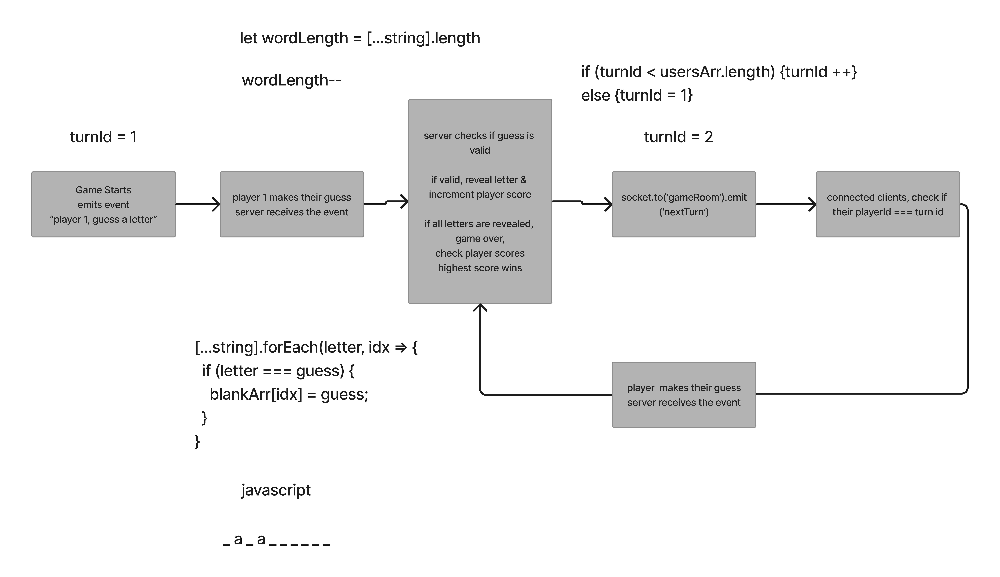
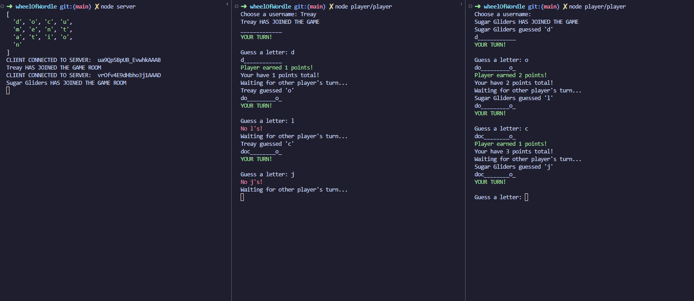

# Wheel of Wordle!

This is a server for a fun word based guessing game where the users take turns guessing a letter until the full word is guessed

  

## Table of Contents

1. [Desciption](#description)
2. [Features](#features)
3. [Prerequisites](#prerequisites)
4. [Installation](#installation)
5. [Usage](#usage)
6. [Creators](#creators)
7. [Contributing](#contributing)
8. [License](#license)

## Description

This is a Node.js server-side code that sets up a Socket.IO server to handle real-time communication
between clients. It creates a game where players join a room and take turns guessing letters to
reveal a secret word. The code initializes a player queue, a word pool, and a secret word. It also
sets up event listeners for when a player joins the game, makes a guess, and when the game is over.
The code emits events to update the clients on the game state and sends messages to the clients to
display on their screens. The `dotenv` package is used to load environment variables from a `.env`
file. The `chalk` package is used to add color to console output.

## UML

## Features

- Event for 'playerJoin': When the player joins, it will prompt them for their username. If they don't enter one, they will be given a random animal name.
- Event for 'gameStart': We wait until 2 players have joined the game room before starting the game.
- Event for 'updatePlayer': Allows us to update the players score.
- Event for 'playerGuess': Takes the players guess and compares it to the secret word. If its correct, it call the playerScore event. If its wrong, it will let them know its wrong.
- Event for 'playerScore': Adds a point the the players score.
- Event for 'PlayerTurn': Keeps track of the players turn based off of their id.

## Prerequisites

List any prerequisites required to use the application, such as:

- chalk: ^4.1.2,
- chance: ^1.1.11,
- dotenv: ^16.0.3,
- prompt-sync: ^4.2.0,
- socket.io: ^4.6.1,
- socket.io-client: ^4.6.1

## Installation

Step-by-step instructions on how to install the application, including code snippets:

\`\`\`bash

## Clone the repository

git clone [https://github.com/KMArtwork/wheelOfWordle](https://github.com/KMArtwork/wheelOfWordle)

## Change into the project directory

cd wheelOfWordle

## Install the dependencies

npm install

## Configure .env

Find (.env.sample) file. Rename it to (.env). It is currently configured for port 3001.

## Run the application in development mode

node server.js

node player/player.js

\`\`\`

## Usage

In order to use this, you will need to open at least 3 terminals. One to start the server with (node server.js) and a terminal for each player(node player/player.js). Start the server first, then start each player. As each player starts their client, they will be prompted for their username. Once both players have created their name or were assigned a default, the game will begin with the client that started first.

## Creators

This project was created by [Kawika Miller](https://github.com/KMArtwork) and [Trey Young](https://github.com/goodpudding)

## Contributing

Explain how others can contribute to your project, including any guidelines or requirements:

1. Fork the project
2. Create your feature branch (`git checkout -b feature/my-feature`)
3. Commit your changes (`git commit -am 'Add my feature'`)
4. Push to the branch (`git push origin feature/my-feature`)
5. Create a new pull request

## License

This project is licensed under the MIT License - see the [LICENSE.md](LICENSE.md) file for details.
