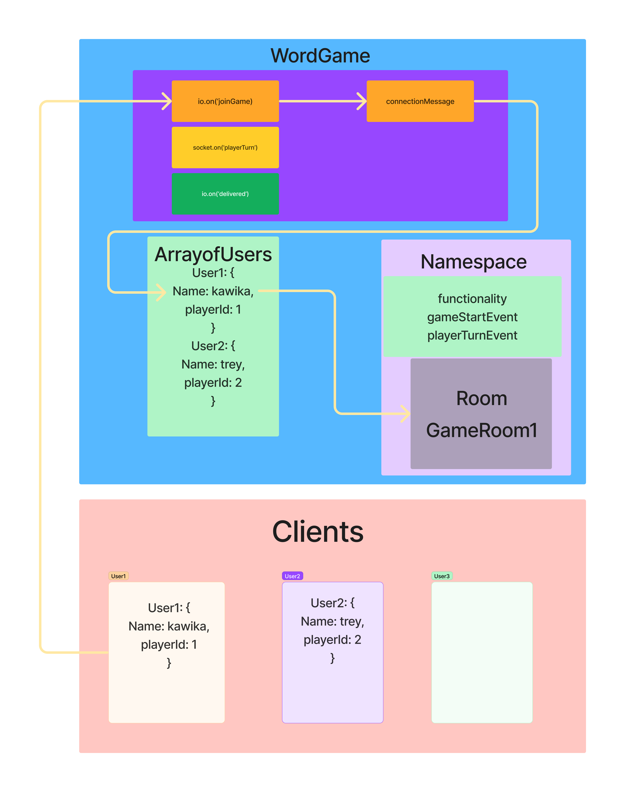

# Wheel of Wordle!

This is a server for a fun word based guessing game where the users take turns guessing a letter until the full word is guessed

  

## Table of Contents

1. [Desciption](#description)
2. [Features](#features)
3. [Prerequisites](#prerequisites)
4. [Installation](#installation)
5. [Usage](#usage)
6. [API](#api)
7. [Testing](#testing)
8. [Contributing](#contributing)
9. [License](#license)

## Description

This is a project called The Code Academy Parcel Service or CAPS. It is designed to act as a third party software between shops and deliver personel. When a shop has an order ready for delivery, they will generate a payload of information that the server distributes to the delivery personel. When the order is picked up and delivered, they store is notified.

## UML

## Features

- Listener for 'pickup': allows to activate features when 'pickup' event occurs
- Listener for 'in-transit': updates the store with status.
- Listener for 'delivered': updates the store and generates a thank you note.

## Prerequisites

List any prerequisites required to use the application, such as:

- Node.js (version 14.x.x or higher)
- npm (version 6.x.x or higher)
- jest
- chance
- prompt-sync

## Installation

Step-by-step instructions on how to install the application, including code snippets:

\`\`\`bash

## Clone the repository

git clone https://github.com/goodpudding/cap.git

## Change into the project directory

cd project-name

## Install the dependencies

npm install

## Run the application in development mode

npm run dev
\`\`\`

## Usage

Provide instructions and examples on how to use your application, including code snippets:

\`\`\`javascript
// Example code snippet
const example = require('your-module');
example.doSomething();
\`\`\`

## API

If your application has an API, provide documentation for each endpoint, including request and response formats.

### `Endpoint 1`

**Request:**

- Method: `GET`
- URL: `/api/endpoint1`
- Parameters: `{ parameter1: 'value1', parameter2: 'value2' }`

**Response:**

- Status: `200 OK`
- Body: `{ key1: 'value1', key2: 'value2' }`

### `Endpoint 2`

**Request:**

- Method: `POST`
- URL: `/api/endpoint2`
- Body: `{ key1: 'value1', key2: 'value2' }`

**Response:**

- Status: `201 Created`
- Body: `{ message: 'Resource created successfully' }`

## Testing

Explain how to run tests for your application:

\`\`\`bash

## Run tests

npm test driver-handler
npm test vendor-handler
\`\`\`

## Contributing

Explain how others can contribute to your project, including any guidelines or requirements:

1. Fork the project
2. Create your feature branch (`git checkout -b feature/my-feature`)
3. Commit your changes (`git commit -am 'Add my feature'`)
4. Push to the branch (`git push origin feature/my-feature`)
5. Create a new pull request

## License

This project is licensed under the MIT License - see the [LICENSE.md](LICENSE.md) file for details.
